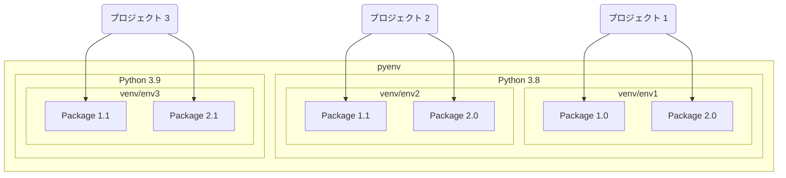

# Python の環境構築

## できること

macOS 上に Python 用の開発環境が構築される。

## 前提

以下の導入が前提。[setup-macos](https://github.com/kazukitash/setup-macos)でインストール方法を説明しているので参照すること。

- HomeBrew

## すること

1. pyenv のインストール
2. 最新の python 言語のインストール
3. venv の使い方

## インストールする Python のバージョンを管理する理由

ソフトウェアを安定して動作させるために、プログラミング言語のバージョンを管理する。プロジェクトごとにプログラミング言語とそのパッケージのバージョンを管理することで、意図しないバージョンでソフトウェアが実行され誤動作することを防ぐ。Python 自体のバージョンを管理する pyenv と実行環境で使用されるパッケージを管理する venv



## Getting started

### pyenv のインストール

macOS の CUI ソフトウェア管理ツール HomeBrew で pyenv をインストールする。

```shell
brew install pyenv
```

シェルの設定をする。以下のコマンドを実行する。

```shell
echo 'export PYENV_ROOT="$HOME/.pyenv"' >> ~/.zshrc
echo 'export PATH="$PYENV_ROOT/bin:$PATH"' >> ~/.zshrc
echo 'eval "$(pyenv init --path)"' >> ~/.zshrc
echo 'eval "$(pyenv init -)"' >> ~/.zshrc
```

シェルの設定を適用する。

```shell
source ~/.zshrc
```

### 最新の python 言語のインストール

以下のコマンドでインストール可能な python を確認する。

```shell
pyenv install --list
```

今回は 3.10.2 を入れる。

```shell
pyenv install 3.10.2
```

入れたバージョンを確認する。

```shell
pyenv versions
```

正常にインストールされていたら、以下のように出力される。

```shell
  system
* 3.10.2 (set by /Users/(ユーザー名)/.anyenv/envs/pyenv/version)
```

使用する python のバージョンを切り替える。

```shell
pyenv global 3.10.2
```

プロジェクト（フォルダ）でバージョンを指定したい場合はプロジェクトのフォルダで以下のコマンドでバージョンを指定する。

```shell
pyenv local 3.10.2
```

### venv の使い方

venv を利用するとプロジェクト（フォルダ）ごとにパッケージの管理ができるようになる。

venv はプロジェクトごとに環境を作成する。testenv という環境を作成するにはプロジェクトのフォルダで以下のコマンドを実行する。

```shell
python -m venv testenv
```

venv を有効にするには環境をアクティベートする必要がある。

```shell
source testenv/bin/activate
```

ターミナルの先頭に以下のように環境名が表示されればアクティベート完了。

```shell
(testenv) $
```

以降 pip でインストールするパッケージは venv で管理される。
環境から抜けたい場合はでアクティベートをする。

```shell
deactivate
```
