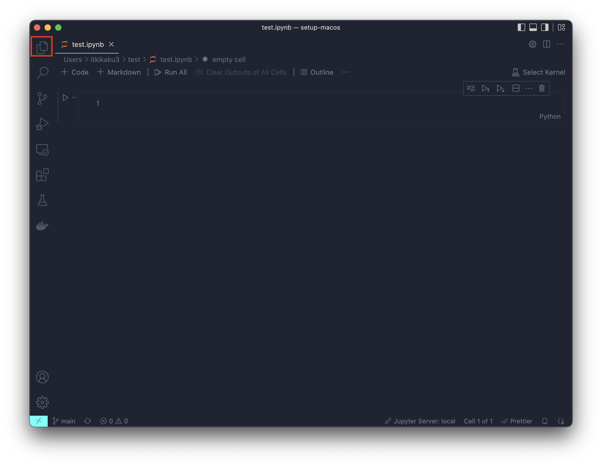
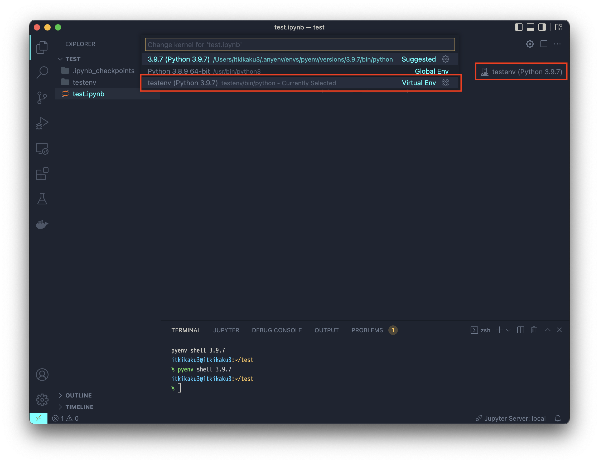
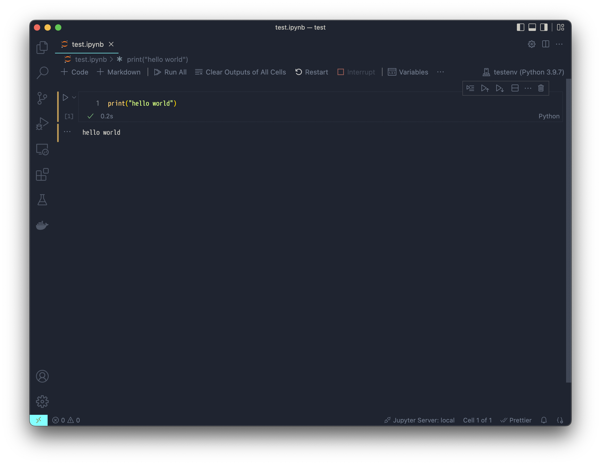

# Python の分析環境構築

## できること

macOS 上に Python の分析開発環境が構築される。

## 前提

以下の導入が前提。[setup-macos](https://github.com/kazukitash/setup-macos)でインストール方法を説明しているので参照すること。

- HomeBrew
- Visual Studio Code

## 目次

1. pyenv のインストール
2. 最新の python 言語のインストール
3. venv の使い方

## pyenv のインストール

macOS の CUI ソフトウェア管理ツール HomeBrew で pyenv をインストールする。

```shell
brew install pyenv
```

シェルの設定をする。以下のコマンドを実行する。

```shell
echo 'export PYENV_ROOT="$HOME/.pyenv"' >> ~/.zshrc
echo 'export PATH="$PYENV_ROOT/bin:$PATH"' >> ~/.zshrc
echo 'eval "$(pyenv init --path)"' >> ~/.zshrc
echo 'eval "$(pyenv init -)"' >> ~/.zshrc
```

シェルの設定を適用する。

```shell
source ~/.zshrc
```

## 最新の python 言語のインストール

以下のコマンドでインストール可能な python を確認する。

```shell
pyenv install --list
```

今回は 3.10.2 を入れる。

```shell
pyenv install 3.10.2
```

入れたバージョンを確認する。

```shell
pyenv versions
```

正常にインストールされていたら、以下のように出力される。

```shell
  system
* 3.10.2 (set by /Users/(ユーザー名)/.anyenv/envs/pyenv/version)
```

使用する python のバージョンを切り替える。

```shell
pyenv global 3.10.2
```

プロジェクト（フォルダ）でバージョンを指定したい場合はプロジェクトのフォルダで以下のコマンドでバージョンを指定する。

```shell
pyenv local 3.10.2
```

## venv の使い方

venv を利用するとプロジェクト（フォルダ）ごとにパッケージの管理ができるようになる。

venv はプロジェクトごとに環境を作成する。testenv という環境を作成するにはプロジェクトのフォルダで以下のコマンドを実行する。

```shell
python -m venv testenv
```

venv を有効にするには環境をアクティベートする必要がある。

```shell
source testenv/bin/activate
```

ターミナルの先頭に以下のように環境名が表示されればアクティベート完了。

```shell
(testenv) $
```

以降 pip でインストールするパッケージは venv で管理される。
環境から抜けたい場合はでアクティベートをする。

```shell
deactivate
```

## python 分析環境の準備

ユーザールートの test フォルダをプロジェクトフォルダとする例を示す。test フォルダを作成してフォルダに移動する。

```shell
mkdir ~/test
cd ~/test
```

venv 環境を作成する。

```shell
python -m venv testenv
source ./testenv/bin/activate
```

ターミナルの先頭が以下のようになっていることを確認する。

```shell
(testenv) $
```

test プロジェクトに jupyter をインストールする。

```shell
pip install jupyter
pip install numpy
pip install pandas
pip install matplotlib
pip install scikit-learn
```

Visual Studio Code で Jupyter ファイルを開けるように拡張機能をインストールする。

```shell
code --install-extension ms-toolsai.jupyter
```

```shell
touch test.ipynb
```

プロジェクトのフォルダを Visual Studio Code で開く。
フォルダを開かないと jupyter で venv 環境をカーネルとして選択できないので注意。

```
code .
```

Visual Studio Code で左のファイルパネルから test.ipynb を開く。





以下を入力してエラーがなく「hello world」が出力されれば問題なし。

```
print("hello world)
```



以下のコマンドで

```
!pip install package名
```
